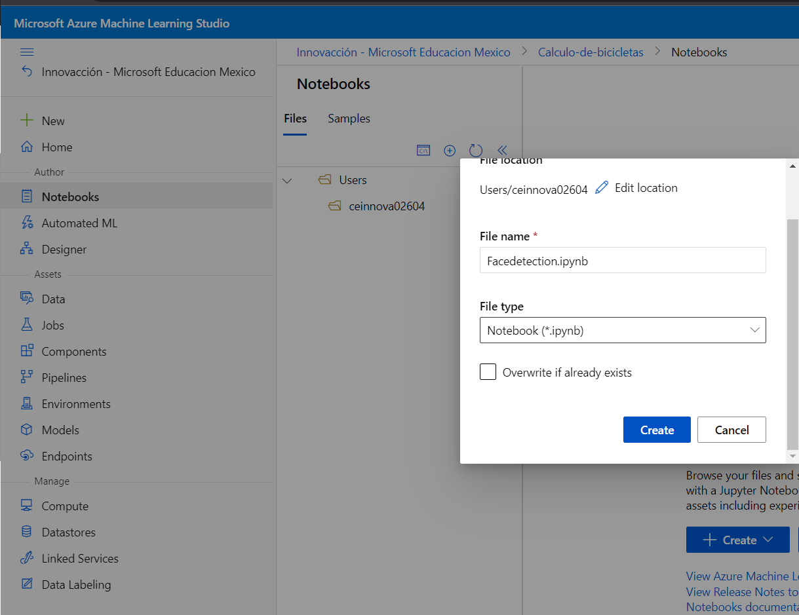
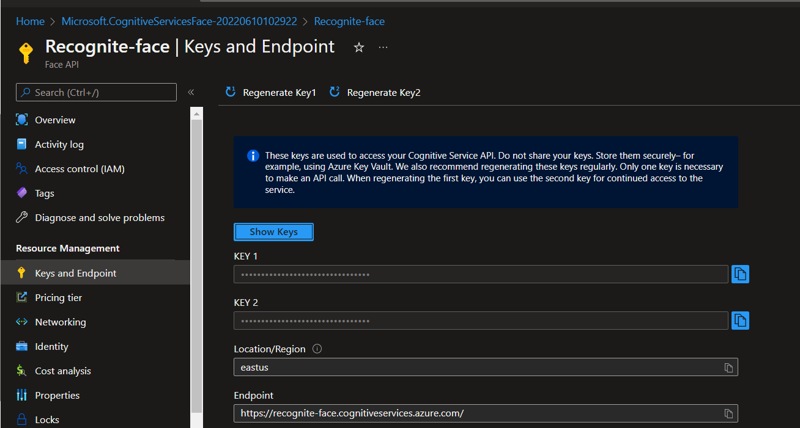
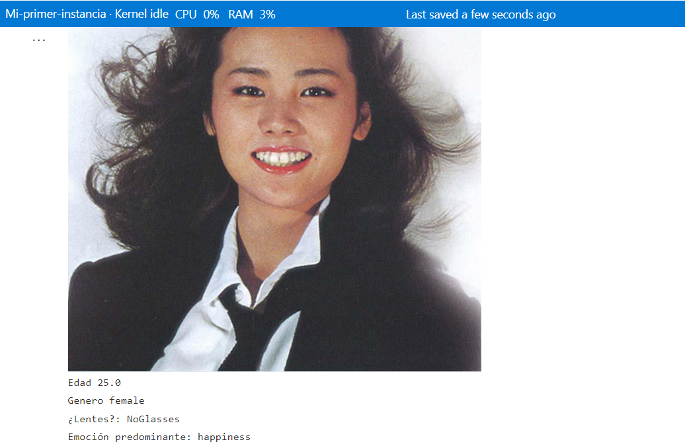

# En este apartado se aprendera como crear una IA que analize los datos de una fotografia

- Primero debemos tener un proceso en [MI azure](https://ml.azure.com/?wsid=/subscriptions/2b3fd9f6-fedf-407d-ae24-9bb213cc8788/resourceGroups/Sesion8/providers/Microsoft.MachineLearningServices/workspaces/Calculo-de-bicicletas&tid=4ae54b05-b77e-4224-aef1-8661422e0816)

Una ves creado un proceso nos iremos al apartado de Notebook

Una ves creado el notebook nos iremos al siguiente link
[Codigo IA](https://raw.githubusercontent.com/josejesusguzman/face-api-consumption-python/main/face-consumption.py) en donde copiaremos tal cual todo el codigo y lo pegaremos en el notebook que acabos de crear

Ahora diregiremos a [Portal Azure](https://portal.azure.com/#home) un recurso que se llama "API de face" y crearemos uno
Una ves creado entraremos al recurso en el apartado "claves y punto de conexion"

Lo que necesitamos es: La "clave 1" y el "Extremo" los cuales copiaremos uno por uno y pegaremos en el apartado que el programa en nuestro notebook nos indica, de la misma manera buscaremos una fotografia de la persona que deseamos analizar y debemos copiar el codigo URL en el apartado que indica el programa y ejecutamos

